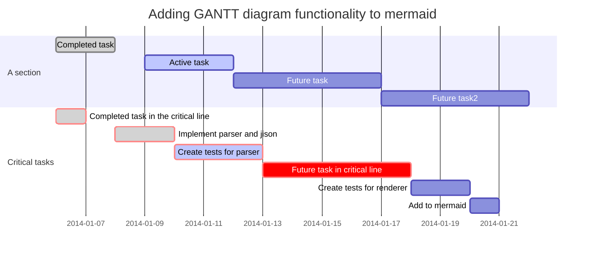

# test_gantt


```mermaid
    gantt
    dateFormat  YYYY-MM-DD
    title Adding GANTT diagram functionality to mermaid
    
    section A section
    Completed task            :done,    des1, 2014-01-06,2014-01-08
    Active task               :active,  des2, 2014-01-09, 3d
    Future task               :         des3, after des2, 5d
    Future task2               :         des4, after des3, 5d
    
    section Critical tasks
    Completed task in the critical line :crit, done, 2014-01-06,24h
    Implement parser and jison          :crit, done, after des1, 2d
    Create tests for parser             :crit, active, 3d
    Future task in critical line        :crit, 5d
    Create tests for renderer           :2d
    Add to mermaid                      :1d
    ```
    
```
gantt

dateFormat YYYY-MM-DD

title 產品計劃表

section 初期階段

明確需求: 2018-09-01, 9d

section 中期階段

跟進開發: 2018-09-11, 15d

section 後期階段

走查測試: 2018-09-20, 9d

```
